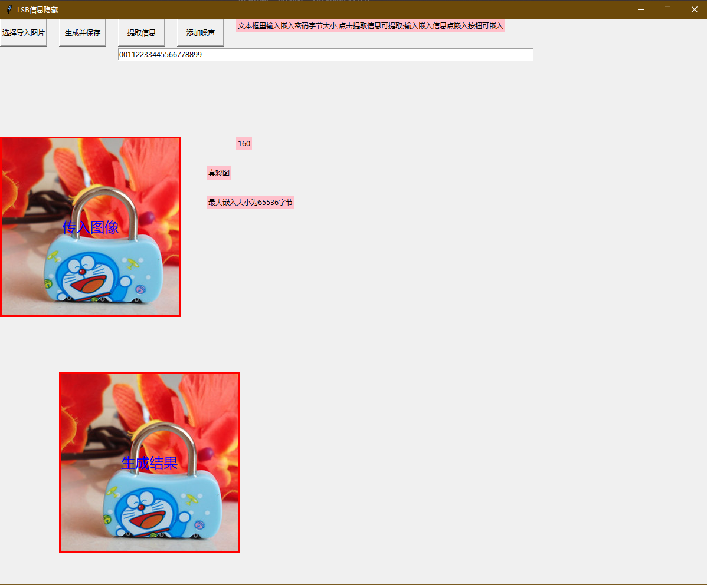
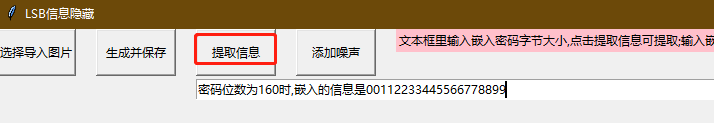
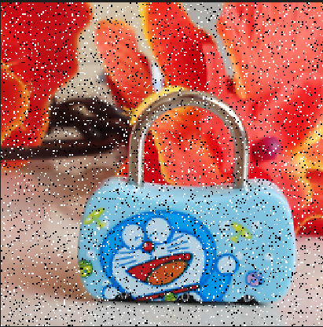
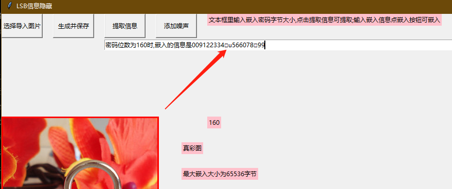
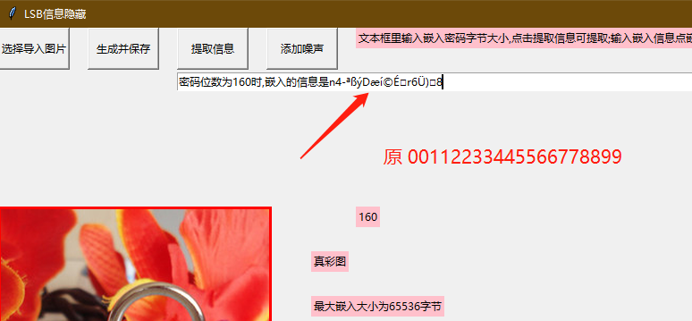
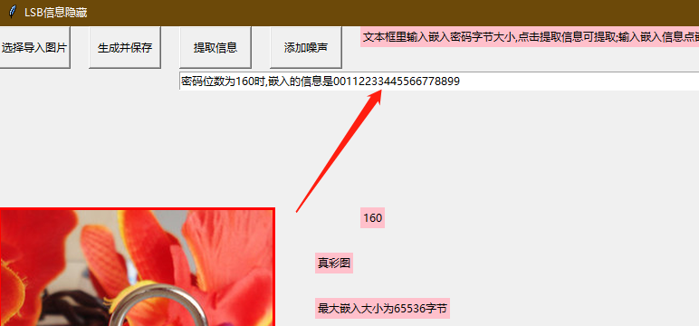

# LSB信息隐藏实验报告

## 一、    数据结构设计

1. 文件头（14字节）：文件头包含文件类型、文件大小、保留字段、图像数据偏移量等信息，其具体结构如下：

| 字节偏移量 | 字段名称 | 字段大小 | 字段说明 |
| --- | --- | --- | --- |
| 0 | 文件类型 | 2 | 表示文件类型，一般为"BM" |
| 2 | 文件大小 | 4 | 表示整个文件大小 |
| 6 | 保留字段1 | 2 | 保留字段，一般为0 |
| 8 | 保留字段2 | 2 | 保留字段，一般为0 |
| 10 | 图像数据偏移量 | 4 | 表示图像数据相对于文件头的偏移量 |

2. 位图信息头（40字节）：位图信息头包含图像宽度、高度、颜色位数等信息，其具体结构如下：

| 字节偏移量 | 字段名称 | 字段大小 | 字段说明 |
| --- | --- | --- | --- |
| 14 | 位图信息头大小 | 4 | 表示位图信息头大小 |
| 18 | 图像宽度 | 4 | 表示图像的宽度 |
| 22 | 图像高度 | 4 | 表示图像的高度 |
| 26 | 颜色平面数 | 2 | 表示颜色平面数，一般为1 |
| 28 | 每像素位数 | 2 | 表示每个像素使用的位数，一般为8 |
| 30 | 压缩类型 | 4 | 表示图像压缩类型，一般为0 |
| 34 | 图像数据大小 | 4 | 表示图像数据大小 |
| 38 | 水平分辨率 | 4 | 表示水平分辨率 |
| 42 | 垂直分辨率 | 4 | 表示垂直分辨率 |
| 46 | 颜色索引数 | 4 | 表示颜色索引数 |
| 50 | 重要颜色数 | 4 | 表示重要颜色数 |

3. 调色板（可选，图像数据偏移量>54bytes时存在，长度为图像数据偏移量-54bytes）：如果图像采用调色板方式存储，则调色板包含了所有可能使用的颜色，每个颜色使用红、绿、蓝三个8位字节表示，其具体结构如下：

| 字节偏移量 | 字段名称 | 字段大小 | 字段说明 |
| --- | --- | --- | --- |
| 54 | 调色板项数 | 4 | 表示调色板项数 |
| 58 | 调色板 | 不定 | 表示调色板，每个颜色使用红、绿、蓝三个8位字节表示 |

4. 图像数据：图像数据包含所有像素的颜色信息，每个像素的颜色使用一个字节表示，其具体结构如下：

| 字节偏移量 | 字段名称 | 字段大小 | 字段说明 |
| --- | --- | --- | --- |
| 图像数据偏移量 | 图像数据 | 不定 | 表示每个像素的颜色信息，每个像素的颜色使用一个字节表示 |

BMP图的结构组成包括文件头、位图信息头、调色板（可选）和图像数据四个部分。在文件读取的过程中都有参数进行接收。

重点用到的字段是：bfSize文件大小，bfOffBits图像数据偏移量，biWidth图像宽度，biHeight图像宽度，biBitCount每像素位数，以及最后的图像像素数据

## 二、    流程设计
1. 打开导入图片（很小的灰度图）
2. 识别并计算最大嵌入信息的长度
3. 嵌入一个较长的信息，进行提示 
4. 换成导入真彩图
5. 重新识别并计算最大嵌入长度
6. 输入嵌入信息，点击按钮嵌入信息并生成新图，命名为 **stego.bmp**
7. 输入预提取信息长度，点击按钮提取信息
8. 添加噪声，查看噪声图片
9. 提取噪声图片**noisy.bmp**的嵌入信息进行比较

## 三、    关键问题
### 1. 如何确定图片类型
颜色平面数和每像素位数都可以区分，灰度图单通道，平面数为1；

真彩图3通道对应3平面，平面数为3，为B，G，R平面；

同理可知，一个通道占用8位，故灰度图的 biBitCount每像素位数为8，真彩图的为24。
### 2. 如何计算图片中可嵌入的最大字节数
- 首先需要明确最大可嵌入长度位数与像素点平面总数相同，即4×4的真彩图最大嵌入位数是4×4×3=48bit，也即6字节(bytes)
- 因为LSB嵌入是对每个通道的最后一位进行修改，所以单通道的灰度图一个像素点可容纳1bit的数据，3通道的真彩图可容纳3bit的数据
- 所以最大字节数直接用图像 $长×宽×通道数÷8$ 即可，程序界面展示的数字是bit单位

这部分重点还是在获取像素信息这块，明白了这个才是真正的整懂bmp图像的结构。我们需要读取掉头部的一系列信息（54bytes+调色板信息长度），才能取到图像数据，数据结构设计中有写调色板的判断，这里说结论：真彩图没有调色板，灰度图有调色板。

### 3. 如何在嵌入信息的图片中存储嵌入信息的长度
该程序中是自己输入长度，根据此长度提取信息，没有实现这一块，就讲一下实现的方法思路。

我们使用固定长度的信息块，并将信息块中的第一个比特位用来表示该块是否为信息长度。这样，在提取信息时，我们可以根据该比特位来判断当前块是信息长度还是数据块。

具体来说，假设我们使用 32bit 作为一个信息块，那么我们可以将每个信息块的第一个比特位用来表示该块是信息长度还是数据块。如果该比特位为 0，则表示该块是数据块；如果该比特位为 1，则表示该块是信息长度块。这样，我们就可以在提取信息时，根据第一个比特位来判断当前块是信息长度还是数据块。

下面这串参考代码有待验证：
```python
from PIL import Image
import textwrap

def get_bit(byteval, index):
    """获取字节中指定位置的比特位"""
    return ((byteval & (1 << index)) != 0)

def set_bit(byteval, index, value):
    """设置字节中指定位置的比特位"""
    if value:
        return byteval | (1 << index)
    else:
        return byteval & ~(1 << index)

# 将信息长度和数据嵌入到图片中
def embed_info(img_path, info, block_size=8):
    img = Image.open(img_path)
    width, height = img.size
    x, y = 0, 0
    info_len = len(info)
    # 将信息长度转换为二进制字符串，并将其分成固定长度的块
    len_bin_str = bin(info_len)[2:].zfill(32) # 转换为 32 位的二进制字符串
    len_block_list = textwrap.wrap(len_bin_str, block_size)
    # 嵌入信息长度
    for block in len_block_list:
        bit_index = 0
        for bit in block:
            pixel = img.getpixel((x, y))
            r, g, b = pixel
            r = set_bit(r, 0, 1 if bit == '1' else 0) # 将信息块的第一个比特位设为 1
            img.putpixel((x, y), (r, g, b))
            bit_index += 1
            if bit_index >= block_size:
                x += 1
                if x >= width:
                    x = 0
                    y += 1
                bit_index = 0
    # 将信息分成固定长度的块
    info_block_list = textwrap.wrap(info, block_size)
    # 嵌入信息
    for block in info_block_list:
        bit_index = 0
        for bit in block:
            pixel = img.getpixel((x, y))
            r, g, b = pixel
            r = set_bit(r, 0, 0) # 将信息块的第一个比特位设为 0
            r = set_bit(r, 1, 1 if bit == '1' else 0) # 将信息嵌入到 LSB 中
            img.putpixel((x, y), (r, g, b))
            bit_index += 1
            if bit_index >= block_size:
                x += 1
                if x >= width:
                    x = 0
                    y += 1
                bit_index = 0
    img.save('embedded.bmp')

# 从图片中提取信息
def extract_info(img_path, block_size=8):
    img = Image.open(img_path)
    width, height = img.size
    x, y = 0, 0
    info_len_bin_str = ''
    while len(info_len_bin_str) < 32:
        block = ''
        bit_index = 0
        while bit_index < block_size:
            pixel = img.getpixel((x, y))
            r, _, _ = pixel
            bit = get_bit(r, 0)
            block += '1' if bit_index == 0 else '0' # 第一个比特位设为 1，其余为 0
            bit_index += 1
            if bit_index >= block_size:
                x += 1
                if x >= width:
                    x = 0
                    y += 1
        info_len_bin_str += block
    info_len = int(info_len_bin_str, 2)
    info = ''
    while len(info) < info_len:
        block = ''
        bit_index = 0
        while bit_index < block_size:
            pixel = img.getpixel((x, y))
            r, _, _ = pixel
            bit = get_bit(r, 1) # 从 LSB 中提取信息
            block += bit
            bit_index += 1
            if bit_index >= block_size:
                x += 1
                if x >= width:
                    x = 0
                    y += 1
        info += block
    return info

# 测试
embed_info('test.bmp', 'Hello, world!')
extracted_info = extract_info('embedded.bmp')
print(extracted_info)
```
### 4. 如何添加的随机噪声
见[#附加要求 1. 增加随机噪声](#1.%20增加随机噪声)

## 四、    基本要求结果展示
完整演示见视频，这里挑重点展示。

（1）导入图片，嵌入信息并保存


（2）提取160位信息

## 五、    附加要求
### 1. 增加随机噪声
这里查阅了椒盐噪声的相关资料后设计了增加椒盐噪声的函数，分别对灰度图和真彩图添加椒盐噪声。

这里简单介绍一下：椒盐噪声模拟的是图像中存在的随机白点和黑点，噪声函数根据噪声比例 添加噪声。具体是先遍历图片的每个像素，如果0-1随机数小于噪声比例，就将该像素设为黑色，如果随机数大于 （1 - 噪声比例），就将该像素设为白色。

这里我们采用了10%的噪声比例：


原来嵌入的数据是’567‘，长度为24，我们从噪声中提取24位的数据，可见6这个信息被干扰了。


我们换一个长一点的嵌入数据，以便观察提取效果，
嵌入：00112233445566778899，长度160

可见差不多25%的信息被干扰，每个数字8位(bit)

### 2. LSB嵌入的抗压缩能力
嵌入：00112233445566778899，长度160；以此为例展开。

将该图stego.bmp保存为jpeg后再转回24位位图，然后提取这个compress.bmp的信息：

可见，抗压缩能力很弱。下面是查阅到的解释：

在压缩图像时，压缩算法通常会尝试找到数据中的重复模式，并使用较短的代码来表示这些模式。这就是压缩的基本原理。LSB嵌入是直接对像素值进行修改，压缩处理后，嵌入的信息可能会被破坏或丢失。

### 3. LSB嵌入的抗裁剪能力
经过上一点的实验，先说自己的大胆猜想：抗裁剪能力一般还行。因为裁剪只会丢失部分像素信息，如果不碰到存信息的那一块，提取的信息应该是差不多完整的。

接下来直接实践（cut.bmp）：

- stego.bmp - <kbd>CTRL+E</kbd> 映像属性 - 256×256调整大小至252×252像素 - 另存为cut.bmp - 不保存关闭画图 - 信息提取

验证猜想正确！

因为信息从第一个像素开始存，真彩图一个像素可以存3位信息，160位信息只需要54像素点即可，一行都绰绰有余；上述裁切操作是裁切右下角部分4像素位边长，不会碰到嵌入信息。

### 4. 设计带密钥的随机间隔LSB嵌入方法
随机间隔LSB嵌入是一种将信息嵌入到图像中的LSB（最低有效位）中，但是每次嵌入的位置都是随机的，以此来增强信息的隐蔽性和抗攻击能力。

在设计带密钥的随机间隔LSB嵌入方法时，我们：
1. 将待嵌入信息进行加密，生成加密后的信息。
2. 将加密后的信息转化为二进制形式。
3. 对于每个二进制位，随机选择一个像素点，将该二进制位嵌入到该像素点的LSB中。
4. 将所有嵌入信息后的像素点组成新的图像(embedded.bmp)，并将加密密钥(key.txt)和嵌入位置(pixels.txt)的随机数记录下来。

